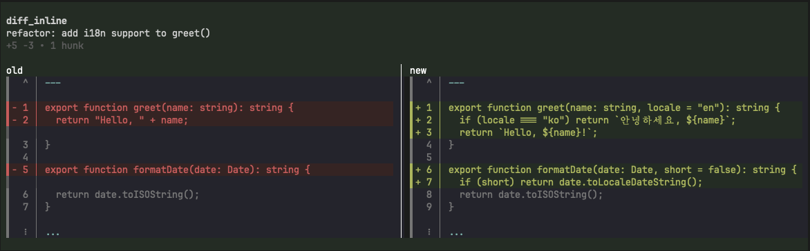
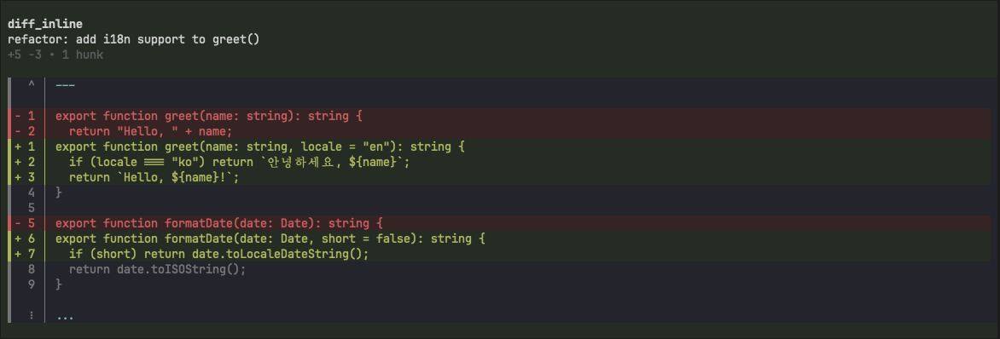

# @kkskcs/pi-diff-inline

Render diffs inline in the pi conversation stream. Supports unified diff text input and text-to-text comparison with inline token highlighting.

## Screenshots

### Split mode (default)



### Unified mode



## Features

- Inline diff rendering in the conversation stream (no full-screen TUI)
- Split (side-by-side, default) and unified view modes
- Inline token highlighting — only changed tokens are highlighted
- Background color tinting for added/removed/context lines
- File boundary markers (^, $, ⋮) with frame lines
- Hanging gutter continuity on wrapped lines
- Multi-block text-to-text comparison (`diffs` array)
- Expandable/collapsible state

## Installation

```sh
pi install @kkskcs/pi-diff-inline
```

## Usage

### Tool: `diff_inline`

Called by the LLM to render diffs inline.

**Parameters:**

| Parameter | Type | Description |
|-----------|------|-------------|
| `diffText` | string | Unified diff text (git diff, diff -u, etc.) |
| `oldText` | string | Original text for comparison |
| `newText` | string | New text for comparison |
| `diffs` | array | Multi-block comparison: `[{oldText, newText, label?}]` |
| `label` | string | Header label shown above the diff |
| `mode` | `"split"` \| `"unified"` | View mode (default: split) |
| `contextLines` | number | Context lines for text-to-text mode (default: 3) |
| `expandable` | boolean | Enable collapsed/expanded toggle (default: false) |

Provide either `diffText`, `oldText`/`newText`, or `diffs` — not multiple.

### Command: `/diff-inline`

```
/diff-inline <free-form text describing what to compare>
```

The input is sent to the LLM, which interprets the request and calls `diff_inline` with appropriate parameters.

## Development

```sh
pnpm install
pnpm run test
pnpm run build
```
